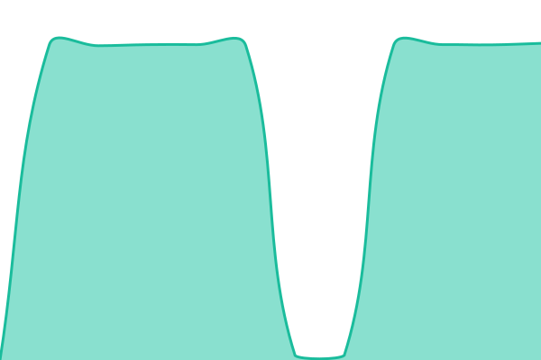

# [📈 Live Status](https://wujianguo.github.io/upptime): <!--live status--> **🟧 Partial outage**

This repository contains the open-source uptime monitor and status page for [Jianguo Wu](http://about.wujianguo.org), powered by [Upptime](https://github.com/upptime/upptime).

With [Upptime](https://upptime.js.org), you can get your own unlimited and free uptime monitor and status page, powered entirely by a GitHub repository. We use [Issues](https://github.com/wujianguo/upptime/issues) as incident reports, [Actions](https://github.com/wujianguo/upptime/actions) as uptime monitors, and [Pages](https://wujianguo.github.io/upptime) for the status page.

<!--start: status pages-->
<!-- This summary is generated by Upptime (https://github.com/upptime/upptime) -->
<!-- Do not edit this manually, your changes will be overwritten -->
<!-- prettier-ignore -->
| URL | Status | History | Response Time | Uptime |
| --- | ------ | ------- | ------------- | ------ |
|  Parse | 🟥 Down | [parse.yml](https://github.com/wujianguo/upptime/commits/HEAD/history/parse.yml) | 

 298ms
     
 | 

<a href="https://status.apphub.work/history/parse">0.00%</a>
    

|  Supabase | 🟩 Up | [supabase.yml](https://github.com/wujianguo/upptime/commits/HEAD/history/supabase.yml) | 

 1160ms
     
 | 

<a href="https://status.apphub.work/history/supabase">100.00%</a>
    

|  [LobeHub](https://chat.libms.top) | 🟩 Up | [lobe-hub.yml](https://github.com/wujianguo/upptime/commits/HEAD/history/lobe-hub.yml) | 

 2144ms
     
 | 

<a href="https://status.apphub.work/history/lobe-hub">100.00%</a>
    

|  [9Router](https://router.apphub.work) | 🟩 Up | [9-router.yml](https://github.com/wujianguo/upptime/commits/HEAD/history/9-router.yml) | 

 2094ms
     
 | 

<a href="https://status.apphub.work/history/9-router">100.00%</a>
    

<!--end: status pages-->

[**Visit our status website →**](https://wujianguo.github.io/upptime)

## 📄 License

- Powered by: [Upptime](https://github.com/upptime/upptime)
- Code: [MIT](./LICENSE) © [Jianguo Wu](http://about.wujianguo.org)
- Data in the `./history` directory: [Open Database License](https://opendatacommons.org/licenses/odbl/1-0/)
